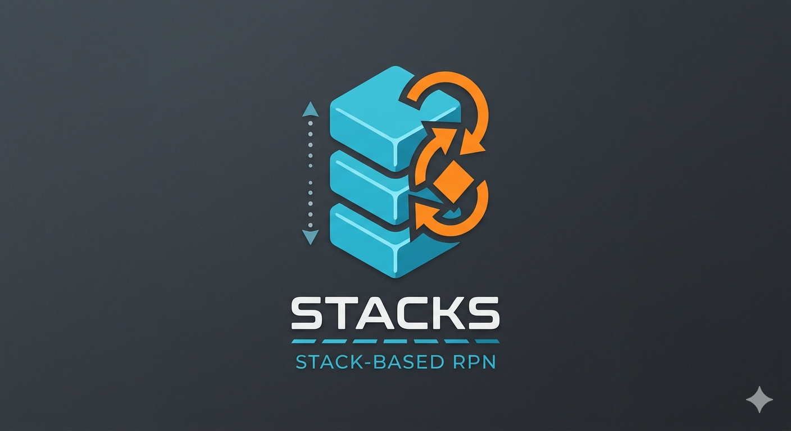

# Stacks Programming Language



Stacks is een op maat gemaakte, stack-gebaseerde programmeertaal, specifiek ontworpen voor de resource-beperkte omgeving van de Stern-ATX virtuele machine. De taal volgt de Reverse Polish Notation (RPN) filosofie, wat efficiënte uitvoering en een compacte syntaxis mogelijk maakt.

## Kernconcepten

### Reverse Polish Notation (RPN)
In Stacks worden operanden vóór operatoren geplaatst. Operaties worden uitgevoerd op waarden die zich bovenaan de datastack bevinden.

**Voorbeeld:**
`3 4 +` resulteert in `7` op de stack.

### Stack-gebaseerd
Alle bewerkingen manipuleren een centrale datastack. Waarden worden op de stack gepusht en operatoren poppen argumenten van de stack en pushen hun resultaten terug.

## Syntaxis Overzicht

### Keywords
De taal ondersteunt de volgende kernkeywords voor programmastructuur en controle:

*   `:label` - Definieert een sprongdoel.
*   `{ }` - Definieert codeblokken (voor functies, loops).
*   `DO END` - Gebruikt met `WHILE` en `TIMES` voor loop body's.
*   `IF ELSE END` - Conditionele uitvoering.
*   `GOTO` - Onvoorwaardelijke sprong naar een label.
*   `DEF` - Definieert een functie.
*   `TIMES` - Herhaalt een codeblok een gespecificeerd aantal keer.
*   `PRINT` - Print de bovenste waarde van de stack.
*   `PLOT` - Plot een punt (context-afhankelijk).

### Condities
Vergelijkingen die een booleaanse waarde (waar/onwaar) op de stack plaatsen:

*   `==` (gelijk aan)
*   `!=` (niet gelijk aan)
*   `<` (kleiner dan)
*   `>` (groter dan)

### Expressies (Stack Manipulatie & Aritmetiek)

*   `+`, `-`, `*`, `/`, `%` - Basis rekenkundige operaties.
*   `DUP` - Dupliceert de bovenste waarde van de stack.
*   `SWAP` - Verwisselt de twee bovenste waarden van de stack.
*   `DROP` - Verwijdert de bovenste waarde van de stack.
*   `OVER` - Kopieert de tweede waarde van de stack naar de top.

### Programma Flow

**Conditionele uitvoering:**
```stacks
condition IF true_expression ELSE false_expression END
```

**Loops:**
```stacks
WHILE condition DO expression DONE
```

**Jumps:**
```stacks
:start_label
    ; ... code ...
    GOTO :start_label
```

### Functies
Functies worden gedefinieerd met `DEF` en kunnen argumenten van de stack halen en resultaten terugplaatsen.

```stacks
DEF my_function {
    ; ... program code ...
}
```

## Interpreter & Compiler

De Stacks-omgeving ondersteunt zowel directe uitvoering als gecompileerde programma's.

### Interpreter Modes
*   **Immediate Mode:** Commando's worden direct uitgevoerd, maar ondersteunen geen `GOTO` of conditionele instructies.
*   **Program Mode:** Ondersteunt volledige programmaconstructies, inclusief labels en control flow.

### Compiler Fases
De compiler werkt in drie hoofdfases om Stacks-code om te zetten naar uitvoerbare instructies:

1.  **Scan Fase:** Een snelle eerste pass om alle `:label` definities te vinden en een labeltabel op te bouwen.
2.  **Compile/Tokenize Fase:** Een tweede pass die de tekst leest en een compacte, numerieke, geoptimaliseerde versie van het programma naar een `TOKEN_BUFFER` schrijft. Alle string lookups en parsing gebeuren hier. Functies worden toegevoegd aan een indexlijst die verwijst naar hun startadres in een `FUNCTION_BUFFER`.
3.  **Execution Fase:** De snelste fase. De hoofdloop van de interpreter leest alleen uit de `TOKEN_BUFFER` en voert commando's op volle snelheid uit.

## Ecosystem & Bibliotheken

Stacks is ontworpen voor de Stern-ATX, een virtuele machine met strikte geheugenbeperkingen.

### Stern-ATX Systeem Constraints
*   **Totaal Geheugen:** 24KB (words).
*   **Heap:** 6KB (6144 words) voor objecten.
*   **Lineaire Heap:** Geen Garbage Collector; objecten kunnen niet worden vrijgegeven. Dit vereist zorgvuldig geheugenbeheer (`NO-NEW-IN-LOOP` principe).
*   **16-bit Precisie:** Ontworpen voor 16-bit integer operaties.

### VVM (Virtual on Virtual Machine) & SIMPL
De Stern-ATX kan meerdere "Virtual on Virtual Machines" (VVM's) hosten. Deze VVM's draaien code geschreven in SIMPL (Stacks Intermediate Machine Programming Language), een bytecode-formaat dat efficiënt is voor opslag en uitvoering.

*   **VVM.create:** Initialiseert een VVM met SIMPL-code en een communicatiekanaal (`VVM-HOST-pointer`).
*   **VVM.start:** Start de uitvoering van een VVM, plaatst argumenten in registers.
*   **VVM.run:** Voert één instructie van de VVM uit ("één tick").
*   **VVM.check_syscalls:** Verwerkt systeemoproepen van de VVM naar de host.

### SL-RDP (Stern Light - Reliable UDP Protocol)
Een betrouwbaar UDP-protocol ontworpen voor de Stern-ATX, met een header van twee woorden (berichttype, volgnummer) en ondersteuning voor flow control, recovery en synchronisatie.

### Array Bibliotheek
Biedt ondersteuning voor dynamische arrays op de heap, inclusief functies voor:
*   `ARRAY.new`: Creëert een nieuwe array met een gespecificeerde capaciteit.
*   `ARRAY.append`: Voegt een element toe.
*   `ARRAY.put`: Update een element op index.
*   `ARRAY.get`: Leest een element op index.
*   `ARRAY.size`, `ARRAY.len`: Geeft capaciteit en huidig aantal elementen terug.

### Neural Network Bibliotheek (`mlnn_lib`)
Een bibliotheek voor het bouwen, trainen en uitvoeren van multi-layer perceptrons.
*   **Fixed-Point Math:** Maakt gebruik van de `fixed_point_lib` om fractionele getallen te simuleren op de integer-gebaseerde CPU.
*   **Data Structuren:** Maakt gebruik van de `ARRAY` functionaliteit voor het beheren van gewichten, biases en lagen.
*   **Algoritmes:** Ondersteunt forward pass (predictie) en backward pass (backpropagatie) met activatiefuncties zoals ReLU.

## Voorbeelden

**Eenvoudige berekening:**
```stacks
12 30 + PRINT
```

**Loop met variabele:**
```stacks
VALUE A 0
WHILE A @ 10 < DO
    A @ DUP PRINT
    1 + A !
DONE
```

**Functie definitie en aanroep:**
```stacks
DEF gcd {
    ; ... implementatie van GCD ...
}
34 7 gcd PRINT
```

**Sinusgolf tekenen (uit `test.stacks`):**
```stacks
; Bereken de som en teken deze in het rood
red TURTLE.color
y1 y2 FP.add y3 FP.add y4 FP.add
; Pas normalisatie toe: (som * 1000) / total_amp
total_amp 0 > IF
    total_amp FP.div 1000 FP.mul
END AS y_sum
wx y_sum draw_point
```

---

Dit document geeft een overzicht van de Stacks programmeertaal en de bijbehorende ontwikkelomgeving.